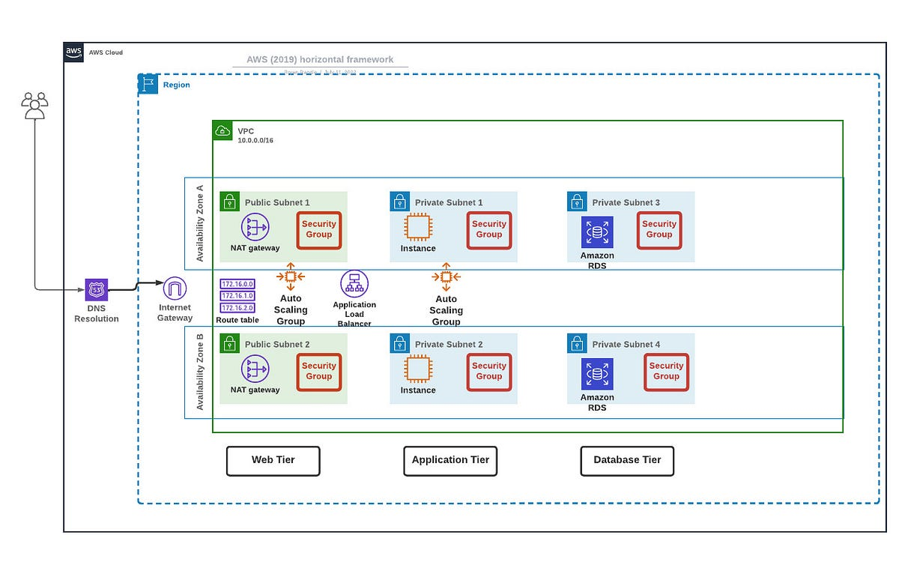

# AWS 3-Tier Architecture (Saabiq)

This project demonstrates a classic three-tier architecture on AWS with a React web tier, a Node.js application tier, and a MySQL-compatible database tier.


## Overview
The system is split into three layers:
1. **Web Tier**: Serves the front-end and forwards API requests.
2. **Application Tier**: Processes business logic and data access.
3. **Database Tier**: Stores and retrieves application data.

## Demo Video
Click the thumbnail to play the video:
[](https://drive.google.com/file/d/1TBPylRpV8xMjKm8ITY1wQZrNzOMi_O-6/view?usp=sharing)

## Architecture Components
1. **Public Load Balancer**: Entry point for client traffic, distributes requests to web servers, and performs health checks.
2. **Web Tier**: Nginx serves the React build and proxies API calls to the internal load balancer.
3. **Internal Load Balancer**: Routes API traffic to application servers.
4. **Application Tier**: Node.js API handles requests and connects to the database.
5. **Database Tier**: Aurora MySQL (or MySQL-compatible) stores transactional data.

## Additional Components
### Load Balancing
**Purpose**: Distributes incoming traffic evenly across multiple instances to prevent any single instance from becoming a bottleneck.
**Implementation**:
- Web Tier: The external load balancer distributes traffic to web servers.
- Application Tier: The internal load balancer distributes API requests to application servers.

### Health Checks
**Purpose**: Continuously monitors the health of instances to ensure only healthy instances receive traffic.
**Implementation**:
- Web Tier: Health checks by the external load balancer to ensure web servers are responsive.
- Application Tier: Health checks by the internal load balancer to ensure application servers are operational.

### Auto Scaling Groups
**Purpose**: Automatically adjusts the number of running instances based on traffic load to maintain performance and cost efficiency.
**Implementation**:
- Web Tier: Auto-scaling based on metrics like CPU usage or request count to add or remove web server instances.
- Application Tier: Auto-scaling based on similar metrics to adjust the number of application server instances.

### AWS Certificate Manager (ACM)
**Purpose**: Manages SSL/TLS certificates to secure data in transit between clients and your application, ensuring encrypted communication.
**Implementation**:
- Certificate Provisioning: ACM provides and manages SSL/TLS certificates for your domain learnaws.co.in.
- Certificate Deployment: The ACM certificates are associated with the public-facing Application Load Balancer (ALB) to enable HTTPS traffic.
- Automatic Renewal: ACM automatically renews certificates before they expire, ensuring uninterrupted secure connections.

### Amazon Route 53
**Purpose**: Manages DNS records and directs user traffic to the appropriate AWS resources, optimizing for performance and reliability.
**Implementation**:
- DNS Management: Route 53 handles DNS queries for the domain learnaws.co.in, translating it into IP addresses for your Application Load Balancer.
- Traffic Routing: Route 53 directs client requests to the public-facing Application Load Balancer based on DNS records.
- Health Checks and Failover: Optionally, Route 53 performs health checks on your endpoints and can automatically reroute traffic to healthy resources if needed.

### Summary
This architecture ensures high availability, scalability, and reliability by distributing the load, monitoring instance health, and scaling resources dynamically. The web tier serves the front-end and routes API calls, the application tier handles business logic and interacts with the database, and the database tier provides robust data storage and retrieval.

## Repository Structure
- `application-code/web-tier`: React front-end.
- `application-code/app-tier`: Node.js API service.
- `application-code/nginx.conf`: Nginx config for the web tier.
- `application-code/nginx-Without-SSL.conf`: Optional non-SSL config.
- `Implementation_Steps.md`: Deployment guide.

## Prerequisites
- AWS account with access to EC2, VPC, ALB, and RDS/Aurora.
- Node.js 16+ for building the web tier.
- Nginx on the web tier instances.

## Quick Start (Local)
From each tier directory, install dependencies:

```bash
cd application-code/app-tier
npm install

cd ../web-tier
npm install
npm run build
```

## Deployment Notes
See [Implementation_Steps.md](Implementation_Steps.md) for the full AWS setup steps, including load balancers, scaling, and database configuration.

## Maintainer
Saabiq
